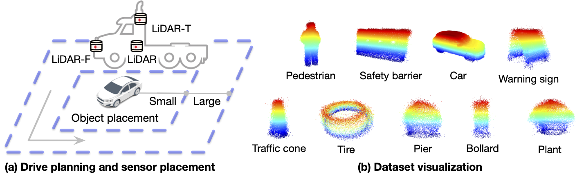

# LiDAR-MVL



| Sensor                        | Details (Sensor location: F: front. T: top.)                 |
| ----------------------------- | ------------------------------------------------------------ |
| LiDAR                 LiDAR-F | Spinning, 64 beams, 10Hz capture frequency, 360° horizontal FOV, 0.6° horizontal resolution, -52.1° to +52.1° vertical FOV, ≤60m range, ±3cm accuracy. |
| LiDAR-T                       | Spinning, 64 beams, 20Hz capture frequency, 360° horizontal FOV, 0.4° horizontal resolution, -25° to +15° vertical FOV, ≤200m range, ±2cm accuracy. |

We establish an object-centric **m**ulti-**v**iew **L**iDAR dataset, which we
dub the **NeRF-MVL** dataset, containing carefully calibrated sensor poses,
acquired from multi-LiDAR sensor data from real autonomous vehicles. It contains
more than **76k frames** covering two types of collecting vehicles, three LiDAR
settings, two collecting paths, and nine object categories.


## Dataset Format

```bash
nerf_mvl
├── nerf_mvl_76k
│   ├── vehicle_type1
│   │   ├── LiDAR
│   │   │   └── {class_name}
│   │   │       ├── l
│   │   │       └── s
│   │   │           ├── {frame_id}.npy
│   │   │           └── lidar2world.txt
│   │   ├── LiDAR_F
│   │   └── LiDAR_T
│   └── vehicle_type2
│       ├── LiDAR
│       ├── LiDAR_F
│       └── LiDAR_T
│
└── nerf_mvl_7k
    └── {class_name}
        ├── {frame_id}.npy
        └── lidar2world.txt

Note:
{class_name}: {bollard, pedestrian, plant, traffic_cone, water_safety_barrier, car, pier, tire, warning_sign}
{frame_id}.npy: local point clouds, (N,4)
lidar2world.txt: the lidar to world matrix, (M, 16)
l/s: large/small collecting paths
```

For fast validation, we extract a  pocket version of the dataset with only 7.3k
frames covering the nine categories, called **nerf_mvl_7k**.

For all point clound frames, we  crop out the region of interest, i.e., the
object. The raw data will also be released to the community soon.


## Citation
If you find our dataset helps, please consider citing:

```
@article{tao2023lidar,
  title={LiDAR-NeRF: Novel LiDAR View Synthesis via Neural Radiance Fields},
  author={Tao, Tang and Gao, Longfei and Wang, Guangrun and Lao, Yixing and Chen, Peng and Zhao hengshuang and Hao, Dayang and Liang, Xiaodan and Salzmann, Mathieu and Yu, Kaicheng},
  journal={arXiv preprint arXiv:2304.10406},
  year={2023}
}
```
