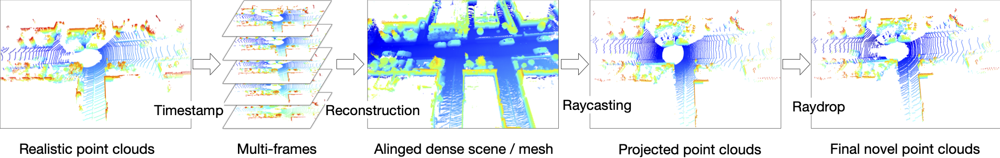

# Lidar Novel View Synthesis Baselines



## LidarSim

```bash
# Generate raydrop dataset.
python lidarnvs/run.py --dataset kitti360 --sequence_id "1538" --enable_collect_raydrop_dataset
python lidarnvs/run.py --dataset kitti360 --sequence_id "1728" --enable_collect_raydrop_dataset
python lidarnvs/run.py --dataset kitti360 --sequence_id "1908" --enable_collect_raydrop_dataset
python lidarnvs/run.py --dataset kitti360 --sequence_id "3353" --enable_collect_raydrop_dataset

# Train the raydrop model.
python raydrop_train.py --data_dir data/raydrop/kitti360_1538 --ckpt_dir log/raydrop/kitti360_1538
python raydrop_train.py --data_dir data/raydrop/kitti360_1728 --ckpt_dir log/raydrop/kitti360_1728
python raydrop_train.py --data_dir data/raydrop/kitti360_1908 --ckpt_dir log/raydrop/kitti360_1908
python raydrop_train.py --data_dir data/raydrop/kitti360_3353 --ckpt_dir log/raydrop/kitti360_3353

# Run lidarnvs again, now with raydrop model.
python lidarnvs/run.py --dataset kitti360 --sequence_id "1538"
python lidarnvs/run.py --dataset kitti360 --sequence_id "1728"
python lidarnvs/run.py --dataset kitti360 --sequence_id "1908"
python lidarnvs/run.py --dataset kitti360 --sequence_id "3353"

# lidarnvs on NeRF-MVL
python lidarnvs/run.py --dataset nerf_mvl --sequence_id "bollard" 
python lidarnvs/run.py --dataset nerf_mvl --sequence_id "car"
python lidarnvs/run.py --dataset nerf_mvl --sequence_id "pedestrian"
python lidarnvs/run.py --dataset nerf_mvl --sequence_id "pier"
python lidarnvs/run.py --dataset nerf_mvl --sequence_id "plant"
python lidarnvs/run.py --dataset nerf_mvl --sequence_id "tire"
python lidarnvs/run.py --dataset nerf_mvl --sequence_id "traffic_cone"
python lidarnvs/run.py --dataset nerf_mvl --sequence_id "warning_sign"
python lidarnvs/run.py --dataset nerf_mvl --sequence_id "water_safety_barrier"
```

## PCGen
### KITTI-360
```bash
python lidarnvs/run.py --dataset kitti360 --sequence_id "1908" --method "pcgen" --enable_collect_raydrop_dataset
python lidarnvs/raydrop_train_pcgen.py --config lidarnvs/configs/pcgen_kitti360_raydrop.txt
python lidarnvs/run.py --dataset kitti360 --sequence_id "1908" --method "pcgen" --ckpt_path pcgen_raydrop_log/kitti360seq1908/raysdrop/010000.tar
```

### LiDAR-MVL
```bash
python lidarnvs/run.py --dataset nerf_mvl --sequence_id "car" --method "pcgen" --enable_collect_raydrop_dataset
python lidarnvs/raydrop_train_pcgen.py --config lidarnvs/configs/pcgen_nerfmvl_raydrop.txt
python lidarnvs/run.py --dataset nerf_mvl --sequence_id "car" --method "pcgen"  --ckpt_path pcgen_raydrop_log/car/010000.tar
```
