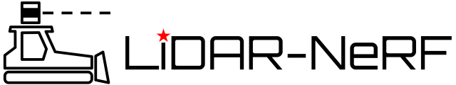
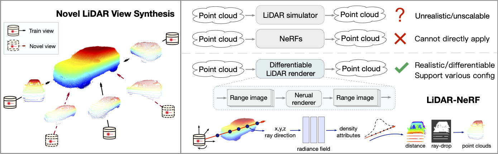
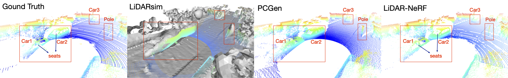

<p align="center">
   
</p>

<h1 align="center">LiDAR-NeRF: Novel LiDAR View Synthesis via Neural Radiance Fields</h1>
<p align="center">
   <a href="https://tangtaogo.github.io/lidar-nerf-website/">
      </a>
   <a href="https://arxiv.org/abs/2304.10406">
      </a>
   <a href="https://youtu.be/YX4LX025mZQ">
      </a>
</p>
<p align="center">
   <a href="https://scholar.google.com.hk/citations?user=1ltylFwAAAAJ&hl=zh-CN&oi=sra">Tao Tang</a>
   ·
   <a href="https://damo.alibaba.com/labs/intelligent-transportation">Longfei Gao</a>
   ·
   <a href="https://wanggrun.github.io/">Guangrun Wang</a>
   ·
   <a href="https://scholar.google.com/citations?user=2w9VSWIAAAAJ&hl=en">Yixing Lao</a>
   ·
   <a href="https://damo.alibaba.com/labs/intelligent-transportation">Peng Chen</a>
   ·
   <a href="https://hszhao.github.io/">Hengshuang Zhao</a>
   ·
   <a href="https://damo.alibaba.com/labs/intelligent-transportation">Dayang Hao</a>
   ·
   <a href="https://scholar.google.com/citations?user=voxznZAAAAAJ">Xiaodan Liang*</a>
   ·
   <a href="https://scholar.google.com/citations?user=n-B0jr4AAAAJ">Mathieu Salzmann</a>
   ·
   <a href="https://scholar.google.com.hk/citations?user=Jtmq_m0AAAAJ&hl=zh-CN&oi=sra">Kaicheng Yu</a>
</p>





This paper introduces a new task of novel LiDAR view synthesis and proposes a
differentiable framework called **LiDAR-NeRF** with a structural regularization,
as well as an object-centric multi-view LiDAR dataset called **NeRF-MVL**.

1. We formulate the first differentiable framework, LiDAR-NeRF, for novel LiDAR
   view synthesis, which can render novel point clouds with point intensity and
   ray-drop probability without explicit 3D reconstruction.
2. We propose a structural regularization method to effectively preserve local
   structural details, thereby guiding the model towards more precise geometry
   estimations, leading to more faithful novel LiDAR view synthesis.
3. We establish the NeRF-MVL dataset from LiDAR sensors of real autonomous
   vehicles to evaluate the object-centric novel LiDAR view synthesis.
4. We demonstrate the effectiveness of our LiDAR-NeRF quantitatively and
   qualitatively in both scene-level and object-level novel LiDAR view
   synthesis.

## News

- [2023/07/14] LiDAR-NeRF v0.1.0 released. NeRF-MVL dataset released.

## Installation

```bash
conda create -n lidarnerf python=3.9
conda activate lidarnerf

# Dependencies
pip install -r requirements_torch.txt
pip install -r requirements.txt

# tiny-cuda-nn
# This may take a while, please refer to the official documentation
pip install git+https://github.com/NVlabs/tiny-cuda-nn/#subdirectory=bindings/torch

# camtools
pip install git+https://github.com/yxlao/camtools.git

# Install lidar-nerf
pip install -e .
python -c "import lidarnerf; print(lidarnerf.__version__)"
```

## Dataset

### KITTI-360 dataset

First, download KITTI-360 dataset from
[here](https://www.cvlibs.net/datasets/kitti-360/index.php) and put the dataset
into `data/kitti360`. Your folder structure should look like this:

```bash
data
└── kitti360
    └── KITTI-360
        ├── calibration
        ├── data_2d_raw
        ├── data_3d_raw
        └── data_poses
```

Next, run KITTI-360 dataset preprocessing:

```bash
# Generate train range images
python preprocess/generate_train_rangeview.py --dataset kitti360

# Generate jsons
python preprocess/kitti360_to_nerf.py

# Calculate center pose (optional) can directly use our config
python preprocess/cal_centerpose_bound.py
```

After preprocessing, your folder structure should look like this:

```bash
data
└── kitti360
    ├── train
    ├── KITTI-360
    │   ├── calibration
    │   ├── data_2d_raw
    │   ├── data_3d_raw
    │   └── data_poses
    ├── transforms_{sequence_id}test.json
    ├── transforms_{sequence_id}train.json
    └── transforms_{sequence_id}val.json
```

### NeRF-MVL dataset

First, download our NeRF-MVL dataset from
[here](https://drive.google.com/drive/folders/1ZCuM3lCvWATXL79WdqrFxbYd4kwsHoTM?usp=sharing).
Your folder structure should look like this:

```bash
$ tree data -l -L 2
data
└── nerf_mvl
    └── nerf_mvl_7k
        └── {class_name}
            ├── {frame_id}.npy
            └── lidar2world.txt
```

Next, run NeRF-MVL dataset preprocessing:

```bash
# If you only download raw nerf_mvl_7k, you need convert it to nerf_mvl_7k_pano(optional)
# or directly download our processed dataset in https://drive.google.com/drive/folders/1pwnIjBUMIYg0fmLaeLj-sKfVcnBexlMq?usp=sharing

# Generate train range images
python preprocess/generate_train_rangeview.py --dataset nerf_mvl

# Generate jsons
python preprocess/nerfmvl_to_nerf.py
```

After preprocessing, your folder structure should look like this:

```bash
data
└── nerf_mvl
    ├── dataset_bbox_7k.npy
    ├── nerf_mvl_7k
    │   └── {class_name}
    │       ├── {frame_id}.npy
    │       └── lidar2world.txt
    ├── nerf_mvl_7k_pano
    │   └── {class_name}
    │       ├── {frame_id}.npy
    │       └── lidar2world.txt
    ├── transforms_{class_name}_test.json
    ├── transforms_{class_name}_train.json
    └── transforms_{class_name}_val.json
```

## Run

```bash
# kitti360
python main_lidarnerf.py -L --workspace log/kitti360_lidar

# nerf_mvl
python main_lidarnerf.py --config configs/nerf_mvl.txt  -L --workspace log/trial_nerf_nerf_mvl
```

## Pre-trained Models

You can download our pre-trained models
[here](https://drive.google.com/drive/folders/1pwnIjBUMIYg0fmLaeLj-sKfVcnBexlMq?usp=sharing).

## Incoming

- [ ] Support multi-modality, e.g., RGB & LiDAR
- [ ] Support more datasets, e.g, nuScenes, Waymo
- [ ] Support more implicit geometry representation, e.g., SDF

We welcome more polished contributions!

## Citation

If you find our code or paper helps, please consider citing:

```bibtex
@article{tao2023lidar,
    title   = {LiDAR-NeRF: Novel LiDAR View Synthesis via Neural Radiance Fields},
    author  = {Tao, Tang and Gao, Longfei and Wang, Guangrun and Lao, Yixing and Chen, Peng and Zhao hengshuang and Hao, Dayang and Liang, Xiaodan and Salzmann, Mathieu and Yu, Kaicheng},
    journal = {arXiv preprint arXiv:2304.10406},
    year    = {2023}
}
```

## Acknowledgments

This code is built on top of the super-useful
[torch-ngp](https://github.com/ashawkey/torch-ngp) implementation.

```bibtex
@misc{torch-ngp,
    author = {Jiaxiang Tang},
    year   = {2022},
    note   = {https://github.com/ashawkey/torch-ngp},
    title  = {Torch-ngp: a PyTorch implementation of instant-ngp}
}
```

The raydrop-mlp code for PCGen is borrowed from
[nerf-pytorch](https://github.com/yenchenlin/nerf-pytorch).

```bibtex
@misc{lin2020nerfpytorch,
    title        = {NeRF-pytorch},
    author       = {Yen-Chen, Lin},
    publisher    = {GitHub},
    journal      = {GitHub repository},
    howpublished = {\url{https://github.com/yenchenlin/nerf-pytorch/}},
    year         = {2020}
}
```
